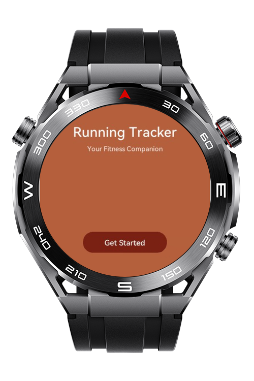
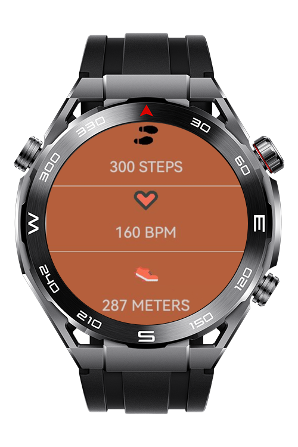
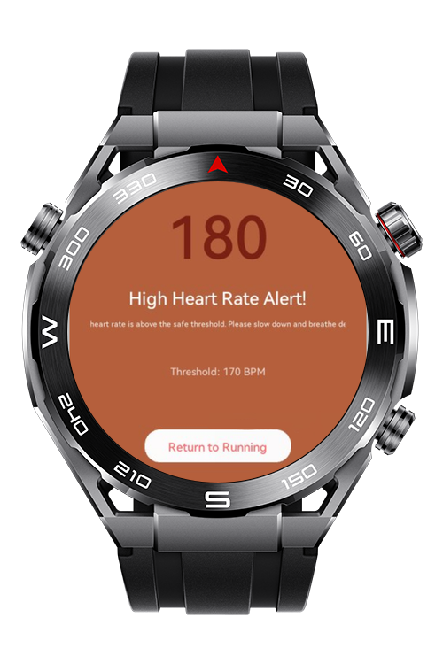

> **Note:** To access all shared projects, get information about environment setup, and view other guides, please visit [Explore-In-HMOS-Wearable Index](https://github.com/Explore-In-HMOS-Wearable/hmos-index).

# PacePulseLite

This is a comprehensive fitness tracking application for running activities with advanced sensor integration and real-time health monitoring features, designed for HarmonyOS NEXT lite-wearable devices. It leverages SensorKit for pedometer and heart rate monitoring.

# Preview
<div>
    
    
    
</div>

# Use Cases

This demo application provides:
- Track running metrics in real-time including step count, distance covered.
- Receive haptic feedback at each kilometer milestone during the running session.
- Monitor heart rate continuously with automatic safety alerts when exceeding user-defined thresholds.
- Navigate seamlessly between running interface and health alerts based on real-time biometric data.
- Ensure user safety with automatic session management and visual/audible warnings for elevated heart rates.


# Technology

## Stack

- Languages: Javascript

- Frameworks: Requires HarmonyOS SDK 5.1.0(18)

- Tools: Requires **DevEco Studio** (e.g. version 5.1.0.842).

- Libraries & Kits:

- `@system.vibrator`
- `@system.router`
- `@system.sensor`

## Required Permissions
- ohos.permission.READ_HEALTH_DATA
- ohos.permission.ACTIVITY_MOTION
- ohos.permission.VIBRATE

# Directory Structure

```
PacePulseLite/
├── entry/
│   └── src/
│       └── main/
│           ├── js/
│           │   └── MainAbility/
│           │       ├── app.js              
│           │       ├── common/
│           │       └── pages/
│           │           ├── index/           
│           │           │   ├── index.css
│           │           │   ├── index.hml
│           │           │   └── index.js
│           │           ├── heartAlertPage/            
│           │           │   ├── heartAlertPage.css
│           │           │   ├── heartAlertPage.hml
│           │           │   └── heartAlertPage.js
│           │           ├── runPage/             
│           │           │   ├── runPage.css
│           │           │   ├── runPage.hml
│           │           │   └── runPage.js
│           ├── resources/
│           │   └── base/
│           │       ├── element/      
│           │       └── media/
│           └── config.json                       
```

# Constraints and Restrictions

## Supported Device
- Huawei Sport (Lite) Watch GT 4/5/6
- Huawei Sport (Lite) GT4/5 Pro
- Huawei Sport (Lite) Fit 3/4
- Huawei Sport (Lite) D2
- Huawei Sport (Lite) Ultimate

# License

PacePulseLite is distributed under the terms of the MIT License
See the [LICENSE](./LICENSE) for more information.


